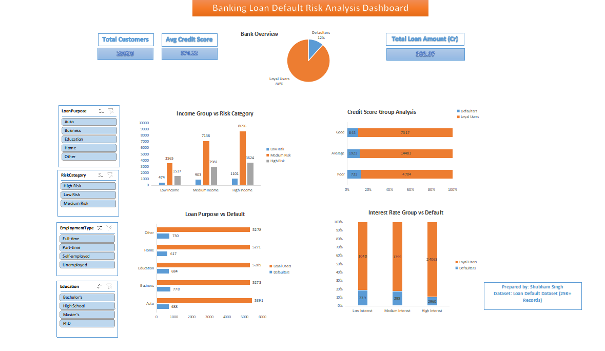

# Banking Loan Default Risk Analysis Dashboard

## Project Overview

Banks face significant financial losses due to loan defaults and risky lending practices. This project analyzes borrower behavior and identifies high-risk customer segments using Excel-based analytics and interactive dashboards.

The dashboard helps stakeholders monitor portfolio health, evaluate borrower quality, and uncover patterns contributing to loan default risk.

---

## Business Problem

Financial institutions struggle to identify risky borrowers before loan approval, leading to increased default rates and financial exposure.

This project was developed to:
- Analyze borrower risk patterns
- Identify high-risk customer segments
- Monitor loan default trends
- Support data-driven lending decisions

---

## Dataset Information

- Source: Kaggle Loan Default Dataset
- Records Analyzed: 30,000+
- Features Included:
  - Income
  - Loan Amount
  - Credit Score
  - Interest Rate
  - Employment Type
  - Loan Purpose
  - Default Status

---

## Tools & Techniques Used

- Microsoft Excel / WPS Office
- Pivot Tables
- Pivot Charts
- KPI Cards
- Slicers
- Data Cleaning
- Data Segmentation
- Dashboard Design
- Business Analysis

---

## Key KPIs

- Total Customers
- Total Loan Amount
- Default Rate %
- Average Credit Score
- Average Interest Rate
- High-Risk Customers

---

## Dashboard Features

- Interactive slicers for filtering
- Risk segmentation analysis
- Credit score risk monitoring
- Loan purpose default analysis
- Interest rate vs default comparison
- Income group risk categorization

---

## Key Business Insights

- Borrowers with poor credit scores showed significantly higher default rates.
- High-interest loan segments demonstrated elevated repayment risk.
- Medium-income borrowers formed the largest customer segment.
- Business and education loans showed relatively higher default contribution.

---

## Business Impact

This dashboard can help financial institutions:
- Improve borrower risk assessment
- Reduce potential loan default exposure
- Support smarter lending decisions
- Monitor portfolio health efficiently
- Identify high-risk customer segments faster

---

## Outcomes

- Analyzed 25K+ borrower records
- Segmented customers into multiple risk categories
- Tracked default trends across income, credit score, and interest rate groups
- Improved visibility into high-risk lending patterns using interactive analytics

---

## Dashboard Preview

---

## Author

Shubham Singh
